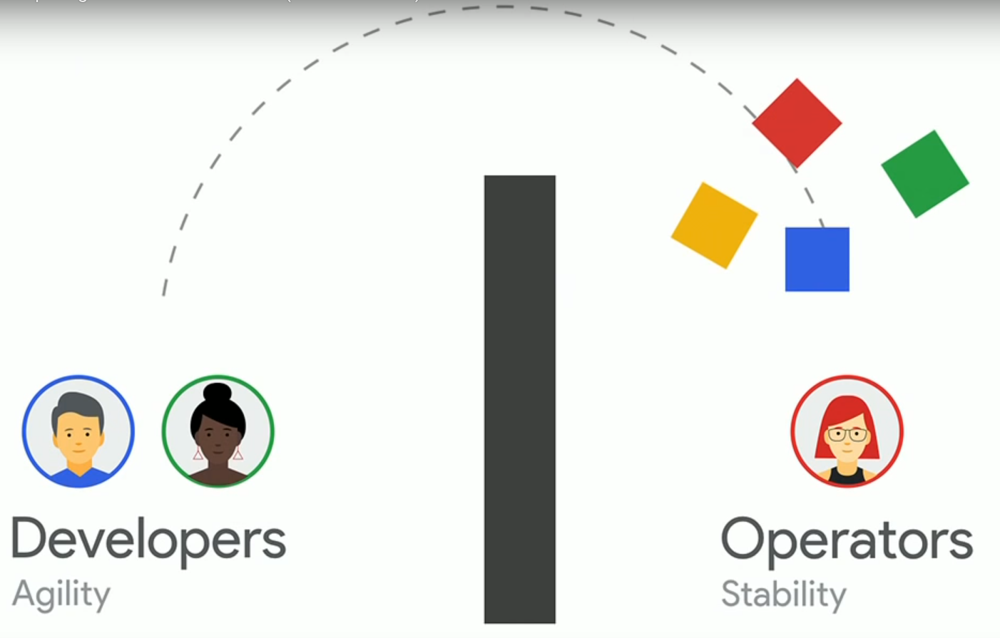
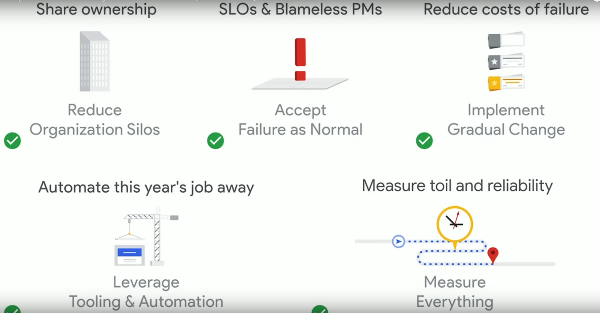
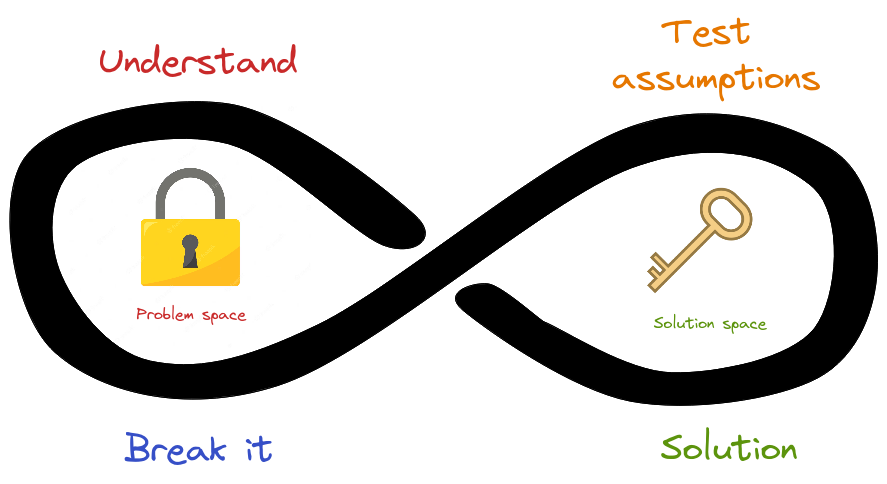
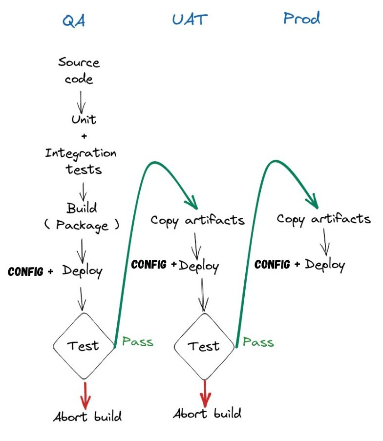
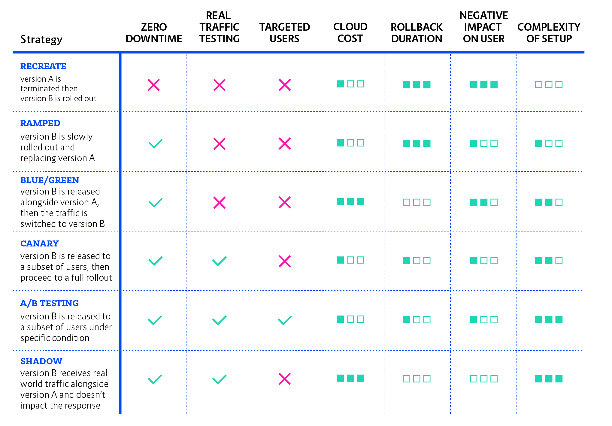
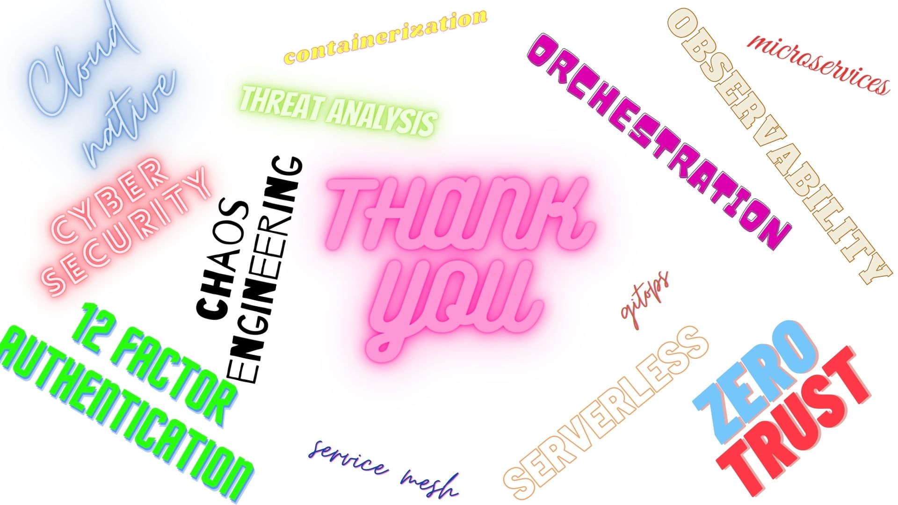

# What it takes to be a DevOps engineer ?

---

# ~ whoami

- I'm Madhan
- Working as a DevSecOps engineer at [TrusTrace](https://trustrace.com/)
- Having 8+ years of experience
- I also write [blogs](https://medium.com/@madhankumaravelu93), with a total of 10+ posts and 40k+ views to date.
- And I maintain few interesting projects at [Github](https://github.com/madhank93)
- You can connect with me on [Linkedin](https://linkedin.com/in/madhank93/)

---

# Is DevOps a Job title or Culture ?

\* _**Not here to start a flame war**_

---

# What is DevOps ?

_DevOps is a set of practices, tools, and a cultural philosophy that automate and integrate the processes between software development and IT teams._

---

# How does it work ?

- Share ownership
- SLOs & Blameless PMs
- Reduce cost of failure
- Automate
- Measure toil and reliability

---

**Class SRE implements DevOps**

**You build it, you run it**

**Operate What You Build**

###### _Tools, Principles and Workflow are aligned with the Culture, People, Team and Organization. And it's very essential it can either make or break the product_

---

# Then why your job title says DevOps ?

_So should I be called **[SRE](https://sre.google/in-conversation/)**, **Infrastructure Engineer**,**[Platform engineer](https://platformengineering.org/blog/what-is-platform-engineering)**, **[Release Engineer](https://sre.google/sre-book/release-engineering/)** or **Cloud engineer**._

---

# First principle thinking

_**A first principle is a basic proposition or assumption that cannot be deduced from any other proposition or assumption**_

---

# Time for Action

---

# Problems in the Coding phase

- How do you track your code changes ?
- What branching strategies should I follow ?
- How to enforce coding style/standards ?
- Is there any commercial/open source solution available ?

---

# Solution

---

# Tracking changes

- **Centralized** - each user gets their own working copy, but there is just one central repository. As soon as you commit, it is possible for your co-workers to update and to see your changes. (Ex: **[Subversion](https://tortoisesvn.net/)**)

  - **You commit**
  - **They update**

- **Distributed** version control, each user gets their own repository and working copy. After you commit, others have no access to your changes until you push your changes to the central repository. When you update, you do not get others' changes unless you have first pulled those changes into your repository. (Ex: **[Git](https://git-scm.com/)**, **[Mercurial](https://www.mercurial-scm.org/)**)

  - **You commit**
  - **You push**
  - **They pull**
  - **They update**

---

# Version control

### OSS

- [Gitea](https://gitea.io/en-us/)
- [Gitlab](https://about.gitlab.com/platform/?stage=plan) - Community edition + commercial
- [Gogs](https://gogs.io/)

### commercial

- [Github](https://github.com/)
- [Bitbucket](https://bitbucket.org/)
- [Azure devops](https://azure.microsoft.com/en-us/products/devops)

---

# Branching Strategies

- **Trunk based development**
- **Gitflow**

For more patterns for Managing source code branches refer [here](https://martinfowler.com/articles/branching-patterns.html#Trunk-basedDevelopment)

---

# Coding standards

- **Hooks** - _It fires custom scripts on a certain events during the execution of a git command, such as **`pre-commit`** and **`pre-push`.**_
  - [Git hooks](https://git-scm.com/book/en/v2/Customizing-Git-Git-Hooks)
  - [pre-commit](https://pre-commit.com/)
  - [husky](https://typicode.github.io/husky/#/)
- **Linters** - is a tool used to flag programming errors, bugs, stylistic errors and suspicious constructs, for example in JS/TS suggesting to use **`let/const`** instead of **`var`**, collection of [linters](https://github.com/collections/clean-code-linters).
- **Formatter** - formats your code and enforces a consistent style across your code, collection of [formatters](https://github.com/rishirdua/awesome-code-formatters).

---

# Problems in the Build phase

- How do I compile my source code ?
- How to manage dependencies ?
- How to generate artifacts ?
- How do I version my artifacts so that I can rollback to ?
- Where do I store my artifacts ?

---

# Solution

---

# Build Automation tools

_**It is a process of automating an extensive range of tasks that one has to do in their day-to-day activity, right from source code to end-product.**_

<ul class="custom-ul">
    <li>Downloading dependencies</li>
    <li>Compile source code into binary code</li>
    <li>Package code into an executable</li>
    <li>Generate documentation out of source code</li>
</ul>

- **Java** : [Ant](https://ant.apache.org/), [Maven](https://maven.apache.org/), [Gradle](https://gradle.org/)
- **Javascript** :
  - Package manager - [npm](https://www.npmjs.com/), [Yarn](https://yarnpkg.com/), [PNpm](https://pnpm.io/)
    **+**
  - Build tools - [Gulp](https://gulpjs.com/), [Webpack](https://webpack.js.org/), [Vite](https://vitejs.dev/)
- **Language agnostic/Multilingual** - [Make](https://www.gnu.org/software/make/), [Bazel](https://bazel.build/), [Buck](https://buck.build/)

---

# Semantic Versioning (SemVer)

_**Semantic Versioning** or **SemVer** contain a set of rules and requirements that dictate how version numbers are assigned and incremented._

**Format** : _MAJOR.MINOR.PATCH_

---

# Repository manager

A repository manager is a dedicated server application designed to manage repositories of binary and artifact components such as _Maven_, _NPM_, _Container_, _RubyGems_ ...

- [Sonatype nexus](https://www.sonatype.com/products/repository-oss-download) - OSS + commercial
- [JFrog](https://jfrog.com/artifactory/) - commercial
- [Gitea](https://gitea.io/en-us/)
- [Gitlab](https://about.gitlab.com/features/?stage=package)

---

# Problems in the Testing phase

- What should be tested at which level ?

---

# Solution

---

# Test pyramid

- Write tests with different granularity
- The more high-level you get the fewer tests you should have

---

# Problems in Release phase

- Why we need Continuous integration/delivery/deployment ?
- How to get the faster feedback cycle ?
- What are some of the oss/commercial service available ?
- How to ensure code quality ?
- Should I build artifacts for each env **`QA`**, **`UAT`**, **`Prod`** ? How should I promote it ?

---

# Solution

---

# Continuos integration/ delivery/ deployment

- [Jenkins](https://www.jenkins.io/)
- [Gitlab](gitlab.com/)
- [Github actions](https://github.com/features/actions)
- [Spinnaker CD](https://spinnaker.io/)
- [Argo CD](https://argoproj.github.io/cd/)

---

# Code quality

- Setting up Go/No-go quality gate
- Security rules
- Code coverage
- Code smells

This process is called _**`Static Application Security Testing (SAST)`**_

### Tools

- [SonarQube](https://www.sonarsource.com/products/sonarqube/) - Community edition + commercial
- [Deep Source](https://deepsource.io/) - commercial

---

# Build once and promote

_**Only build packages once**. The binaries you release should be the same binaries that have been through the rest of your deployment pipeline, so you can be sure that what you release is what you tested._

---

# Problems in Deployment phase

- How to create and manage environment ?
- What is an Infrastructure as Code (IaC) ?
- How do I deploy an application to only a subset of users ?
- How do I rollback when there is an failure ?

---

# Create and Manage environment

_Infrastructure as code (IaC) tools allow you to manage infrastructure with configuration files rather than through a graphical user interface._

- _**[Terraform](https://www.terraform.io/)**_ - It is an _**Infrastructure provisioning**_ tool, using it, we can build, destroy and manage infrastructure in a declarative way. And it takes a immutable approach and uses [HCL](https://developer.hashicorp.com/terraform/language/syntax/configuration).
- _**[Pulumi](https://www.pulumi.com/)** - is a modern IaC platform that allows you to use familiar programming languages and tools to build, deploy, and manage cloud infrastructure._
- _**[Ansible](https://www.ansible.com/)**_ - It is a _**Configuration management**_ tool, mainly used to configure systems, deploy software, and orchestrate more IT tasks using yaml.

###### _Read more about the comparisons at [Ansible vs. Terraform Demystified](https://www.ansible.com/blog/ansible-vs.-terraform-demystified)_

---

# Deployment strategies

---

# Problems in Monitoring phase

- What should be monitored ?
- How to monitor failures ?
- How do I visualize it and get notified ?

---

# Solution

---

# Collecting metrics and monitoring

_**Metrics** represent the raw measurements of resource usage or behavior that can be observed and collected throughout your systems_

- **Host-Based Metrics** - CPU, Memory, Disk space, and Processes
- **Application Metrics** - Error and success rates, Service failures and restarts, Performance and latency of responses, and Resource usage
- **Network and Connectivity Metrics** - Connectivity, Error rates and packet loss, Latency, and Bandwidth utilization

_**Monitoring** is the process of collecting, aggregating, and analyzing those values to improve awareness of your components’ characteristics and behavior_

#### Tools

- [Prometheus](https://prometheus.io/)
- [InfluxDB](https://www.influxdata.com/)
- [Datadog](https://www.datadoghq.com/)
- [New relic](https://newrelic.com/)
- [Grafana](https://grafana.com/) - Visualization

---

# Log monitoring

_Main purpose is to observe the streams of logs generated by the applications to provide information and trigger alerts if something affects system performance and health._

- [Loki](https://grafana.com/oss/loki/)
- [Elastic search- ELK](https://www.elastic.co/elastic-stack/)
- [Sentry](https://sentry.io/welcome/)

---

# Alerts

_Automated alerts are essential to monitoring. It is process of sending notification message informing about a change of state, typically signifying a potential problem in the form of email, SMS, Slack notification, or a ticket._

---

**References**

- [DevOps Vs. SRE: Competing Standards or Friends? (Cloud Next '19)](https://www.youtube.com/watch?v=0UyrVqBoCAU)
- [How Netflix Thinks of DevOps](https://www.youtube.com/watch?v=UTKIT6STSVM)
- [DevOps Culture at Amazon](https://www.youtube.com/watch?v=mBU3AJ3j1rg)
- [Enterprise DevOps: Why You Should Run What You Build](https://aws.amazon.com/blogs/enterprise-strategy/enterprise-devops-why-you-should-run-what-you-build/)
- [Full Cycle Developers at Netflix — Operate What You Build](https://netflixtechblog.com/full-cycle-developers-at-netflix-a08c31f83249)
- [Atlassian Devops Guide](https://www.atlassian.com/devops)
- [First Principles: The Building Blocks of True Knowledge](https://fs.blog/first-principles/)
- [First Principles for Software Engineers](https://addyosmani.com/blog/first-principles-thinking-software-engineers/)
- [Version control concepts](https://homes.cs.washington.edu/~mernst/advice/version-control.html)
- [Atlassian Gitflow workflow](https://www.atlassian.com/git/tutorials/comparing-workflows/gitflow-workflow)
- [Trunk based development](https://trunkbaseddevelopment.com/)
- [Practical test pyramid](https://martinfowler.com/articles/practical-test-pyramid.html)
- [Build promotion](https://www.thoughtworks.com/en-in/insights/blog/build-promotion-go)
- [Deployment strategies](https://thenewstack.io/deployment-strategies/)
- [An Introduction to Metrics, Monitoring, and Alerting](https://www.digitalocean.com/community/tutorials/an-introduction-to-metrics-monitoring-and-alerting)
- [Effective Monitoring and Alerting](https://www.oreilly.com/library/view/effective-monitoring-and/9781449333515/)

---

